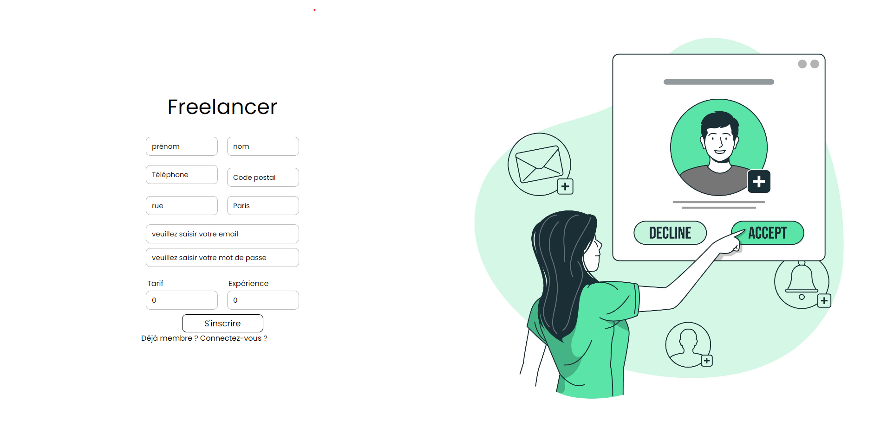

# Fonctionnalités

Une interface de connexion et d’inscription ✅

L’application permet de consulter et rechercher des freelances à partir de la homepage

# Deux types d’inscriptions :

Inscription de compte Freelance✅
Inscription de compte Entreprise✅

# Tous les utilisateurs (freelance et entreprise) peuvent :

Modifier leur profil ✅ Que freelances pour le moment
Se connecter et accéder à leur compte ✅
Régénérer un mot de passe (mot de pass oublié)

# Interface Freelance

Consulter les propositions de missions envoyées par les entreprises
Accepter ou décliner une proposition de mission

# Interface Entreprise

Créer, modifier, supprimer une mission
Proposer une mission à un freelance

# Un accès administrateur permet :

d’ajouter/modifier/supprimer des compétences
d’ajouter/modifier/supprimer des métiers
consulter tous les utilisateurs de l’application (entreprise et freelance)
Supprimer un utilisateur
consulter les missions et les propositions rattachées

